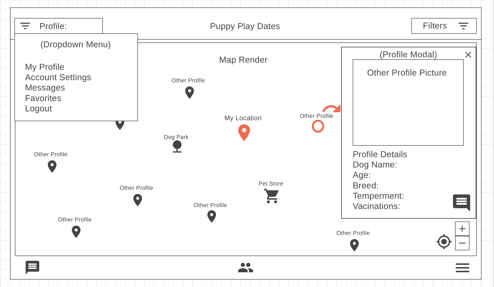

# Puppy Play Dates

## Puppy Play dates
Puppy Play Dates is an interactive social application that connects dog owners to one another to socialize and walk their pets.

## Background and Overview
During your puppy’s first three months of life, they will experience a socialization period that will permanently shape their future personality and how they will react to their environment as an adult dog. Gently exposing them to a wide variety of people, places, and other dogs will makes a huge, permanent difference in their temperament.
This application will allow Dog owners to find other dogs in their area for their pet to socialize with. Making sure that they won't be overly fearful or aggressive to other dogs. Users will sign up for an account, upload a profile for their do with images, vaccination status, temperament, etc. Filtering will allow Users to see which of their friends are online and in the area, as well as searching for other dogs that may be suitable friends for their pup. Once friendship is established, users may interact with each other by messaging one another and setting up time/places for their dogs to socialize.

## Functionality & MVP
User authorization: sign up and log in
User/Dog profile creation with images
Google Maps API that display’s online users, pet stores, parks, groomers, veterinarian etc.
Informational modal displaying selected profiles or businesses and chat between users to set up playdates.
 Filtering/search functionality to display/hide friends, parks, businesses. 
 Production README

### Bonus Features
 LiveChat between users using websockets
 Map my walk feature tracking walks with your pup

## WireFrames

## Technologies & Technical Challenges
Puppy Play dates relies on Geolocation and Google Maps Platform to display locational information for profiles, businesses, parks etc. AWS will allow users to upload profile pictures. Future functionality will employ Websockets for live chat. 

Backend: MongoDB/Express

Frontend: React/Node.js Google API Geolocation and Websockets

## Technical challenges:
Implementation of Google Maps and using locational data to plot the exact location of users in relation to their surroundings. Filtering to display other users/businesses within a specific location radius. Livechat messaging for users to plan play-dates/walks etc. 

## Group Members & Work Breakdown
    Logan Hartman - Lead
    Luis Perez - Backend
    Mei Huang - Frontend
    Janira Crispin - Flex

### Weekend
    All Members: meet to discuss application MVP, begin User Auth

#### Monday
    Logan: Production Documentation, Google Maps/Geolocation API
    Luis: Complete Backend User Auth and database structure Luis
    Mei: Profile/Business modal and Nav Bar,
    Janira: AWS setup/implementation

#### Tuesday
    Logan: Map Rendering 
    Luis/Mei: Backend/frontend integration. Luis/Mei
    Janira: Profile photo uploads

#### Wednesday
    Logan: Map Rendering/Geolocation
	Luis/Mei/Janira: Complete backend/frontend integration and seeding 

#### Thursday
    Logan/Janira: CSS styling
    Mei/Luis: Backend search/filtering

#### Friday
	All Members: Presentation
